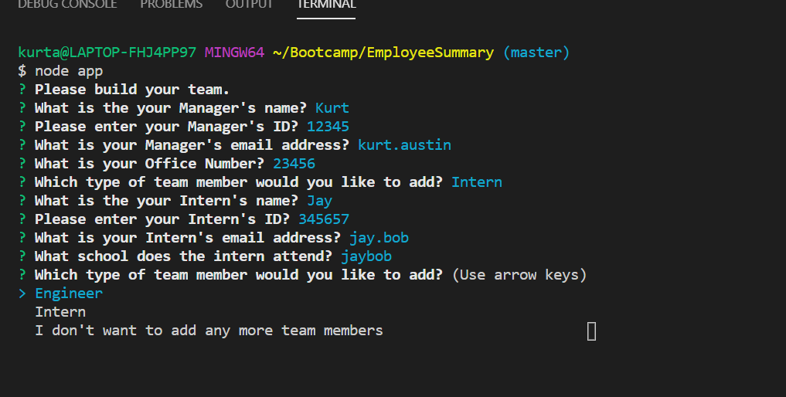
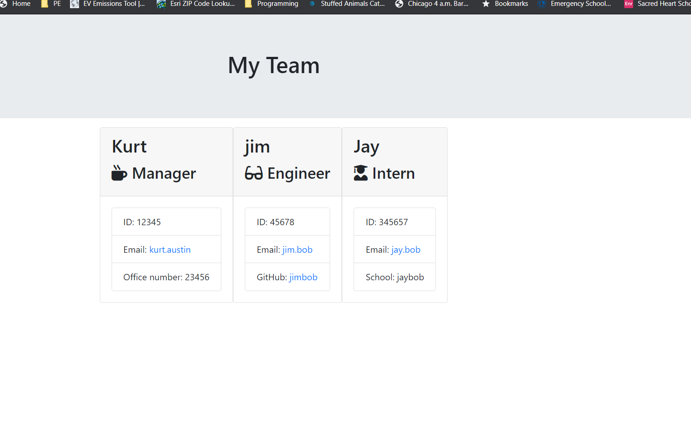

# Employee Summary

This application takes user input from a CLI (command line Node package) to build out an engineering team.

## Instructions

You will build a software engineering team generator command line application. The application will prompt the user for information about the team manager and then information about the team members. The user can input any number of team members, and they may be a mix of engineers and interns. Once the team has been completed within the input, you will see the organizational tree in the generated HTML file.

* Your app will run as a Node CLI to gather information about each employee.

  

* Your view the generated Index.html file to see the results.

  

## Technology Requirements/Techniques Used

* Inquirer NPM Packages (Node.js).  This would need to be installed as well as npm install.  This generates the questionnaire.

* The use of classes in Javascript.

* There is also a series of tests to run while developing the application that passed successfully.  To run the tests, jest would need to be installed as well.  And to run these tests at any time, you would use the command `npm run test`